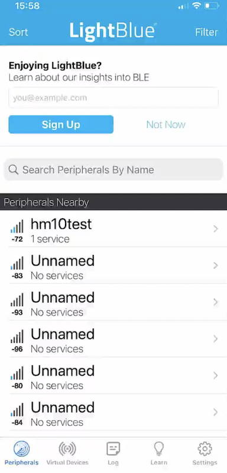

### HM-10 BLE Library Implementation

Download the HM-10 [datasheet](https://people.ece.cornell.edu/land/courses/ece4760/PIC32/uart/HM10/DSD%20TECH%20HM-10%20datasheet.pdf)

     
     
### UART GPIO Config for NucleoF411
      
<u>Nucleo's UART1 to use with HM10 </u>       	    
         
* We use **PA9** `UART1_Tx` with HM10's `Rx`
* And **PA10** `UART1_Rx` with HM10's `Tx`
       
       
<u>Nucleo's UART2 to use for Debug output</u>      
       
* We use **PA2** on Nucleo as `UART2_Tx`
* And **PA3** as `UART2_Rx`   
* _SerialTool_ on MacOSX or _RealTerm_ on Windows to get debug output      
      
      
### Test HM10 Connectivity
      
* _LightBlue_ App available both on `App Store` as well as `Play Store`    
      
      
      
                 