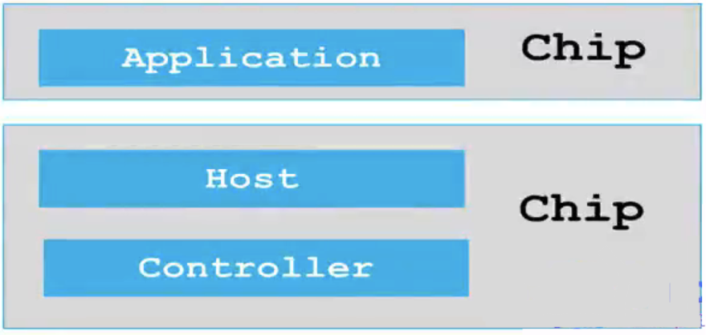

## Embedded ARM Cortex C++ BLE Bluetooth Library for HM-10

           
**Connections**     
      
									 

### Bluetooth Introduction     
      
* Bluetooth classic (Any bluetooth version below 4 is Bluetooth Classic)
* Bluetooth Low Energy (BLE, from version 4 onward)     
      
			
|    Bluetooth Low Energy (BLE)    |         Bluetooth Classic        |
|:---------------------------------|---------------------------------:|
| Low bandwidth applications (e.g. sensor data) | High bandwith applications (e.g. audio streaming)  | 
| Optimised for low power  | Not optimised for low power  |
| Operated over 40 RF channels   | Operates over 79 RF channels  |
| Discovery occurs over 3 channels (hence quicker connection)   | Discovery occurs over 32 channels  |    
       
			 
### History
       
* First introduced in May 1998
* First bluetooth specification (Bluetooth 1.0) was published in 1999
* Sony Ericsson T36 became the first mobile phone with Bluetooth in 2001
* Bluetooth 2.0 + Enhanced Data Rate (EDR) which improved both range and bandwidth was released in 2004
* Bluetooth 3.0 which introduced high speed transfers and allowed devices _to transfer files over WiFi_ while simultaneously communicating over Bluetooth was in 2009
* Bluetooth Low Energy (Bluetooth 4.0) was launched in early 2010
* First smartphone to support Bluetooth 4.0, iPhone 4S was released in October 2011
* Bluetooth v4.2 which provided security upgrade, IP connectivity and increased speed was released in December 2014
* Bluetooth v5.0 which provided 2x the speed and 4x the range of Bluetooth 4 was released in December 2016   
       
			 
### Evolution of wireless technologies      
       
|          Bluetooth          |       Ethernet        |           WiFi.       |      Modems     |
|:----------------------------|:---------------------:|:---------------------:|----------------:|
|  **v1.1** : 1Mbps   BR      | 802.3i  : 10Mbps      | 802.11   : 2Mbps      | v.21 : 0.3kpbs  |
|  **v2.0** : 3Mbps   EBR     | 802.3u  : 100Mbps     | 802.11b  : 11Mbps     | v.22 : 1.2kpbs  |
|  **v3.0** : 54Mbps  MAC PHY | 802.3ab : 1000Mbps    | 802.11g  : 54Mbps     |	v.32 : 9.6kpbs  |		 
|  **v4.0** : 0.3Mbps BLE     | 802.3an : 10000Mbps   | 802.11n  : 135Mbps    | v.34 : 28.6kpbs |
|  **v5.0** : 2Mbps   BLE     |                       |                       |                 |   
       
**BR**: Basic Rate   **EBR**: Enhanced Basic Rate  **MAC**: Medium Access Control 	**PHY**: Physical Layer	    
     
		  
### Bluetooth device types and Nomenclature.     
        
* <u>Bluetooth Smart</u>: Single Mode (BLE only)				   			
* <u>Bluetooth Smart Ready</u>: Dual Mode (BLE and Bluetooth Classic)
* <u>Bluetooth</u>: Bluetooth classic only (BR/EBR)      
        
		
      
			
### Stack Splits					
      
Three main blocks of the architecutre.     

* **Application** The application uses the host software to build use cases 			
* **Host** The Software that manages how two or more devices communicate
* **Controller** A physical device that can transmit and receive radio signals      
          
					
						
					
Each block is made of layers. (Layer: A part of a system that fulfills a specific function)			
          
					
#### Single - Chip solution
         
The **Application** block, the **Host** block and the **Controller** block are all in the same chip	       
   
		 		
         
				 
#### Two - Chip solution
         
The **Application** block and the **Host** block are in the same chip while the **Controller** block is a separate chip	       
   
		
     
		 
The **Host** block and the **Controller** block are in the same chip while the **Application** block is a separate chip			      
   
		
     
				
#### Three - Chip solution
         
The **Application** block, the **Host** block and the **Controller** block are all in the separate chips	       
   
		 
         
				 
### Our configuration is Two - Chip solution			   
          
							 
									
									
### Advertisement
          
Bluetooth Low Energy (BLE) has two ways of communicating:
      
1. **Advertisement** Over here a peripheral device (slave) broadcasts packets to every device around it. The receiving device simply take the packet or connect to the broadcasting device to receive more information.
        
2. **Connection** Over here both the peripheral device and the central device (master) send packets.    
        
				   
* Advertising is _unidirectional_. A Central device cannot send data to the Peripheral device without connection, but a single peripheral can advertise to multiple central devices.    
				   
* In _advertising mode_, advertising packets are sent periodically. The time interval between each advertisement event is known as the **advertisement interval**.					 	
         
* It means how often advertisement packet will be transmitted by advertiser.       
          
* Typically set from every _20 milliseconds_ to every _10.24 seconds_            
          
* This parameter greatly affects _battery life_
        
* The smaller the value, the more power it consumed																		 			
																				 	 							